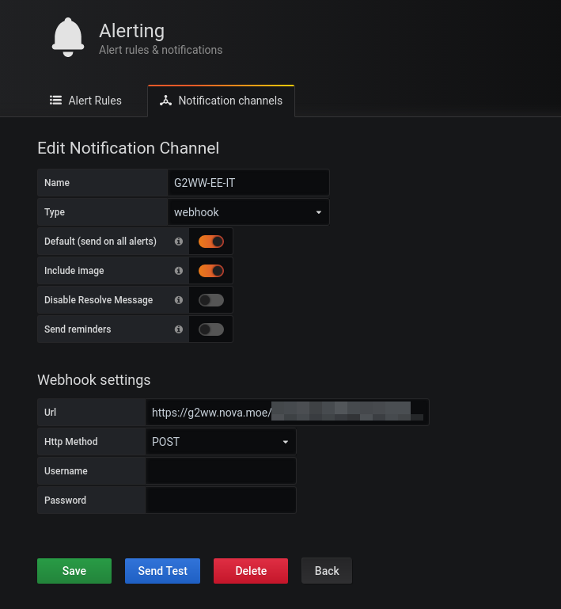
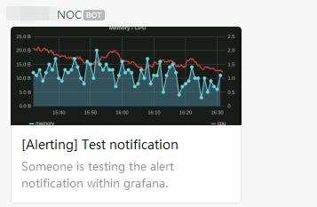

# G2WW (Grafana 2 Wechat Work) Serverless Edition
> Proxy Grafana Webhook alert to WeChat Work.

Grafana doesn't support push alert to WeChat Work(企業微信) by it's design(They even close my PR: [Add a new notifier : WeChat Work（企業微信） #26109](https://github.com/grafana/grafana/pull/26109)), this is a small adapter for supporting this.

This is the serverless-edition of [n0vad3v/G2WW](https://github.com/n0vad3v/g2ww), now it's in 「Staff Picks」 of [Built with Workers](https://workers.cloudflare.com/built-with).

## Installation

Simple copy the content of `index.js` to Cloudflare Workers.

## Usage

### Create a Wechat Work Bot

Create a Wechat Work Bot and get the webhook address.

For instance, the webhook address is `https://qyapi.weixin.qq.com/cgi-bin/webhook/send?key=e28dde4c-1998-0002-0018-114514114514`.

### Configure Grafana

In the configuration above, we need to specify the address like this:

`https://g2ww-serverless.nova.moe/e28dde4c-1998-0002-0018-114514114514`

### Demo

Quite simple, isn't it?